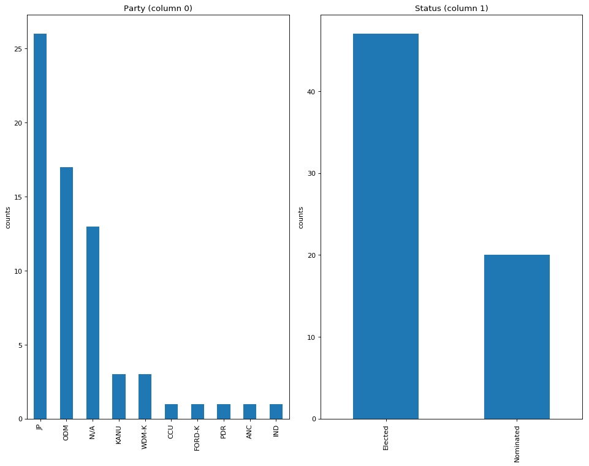

[](https://travis-ci.com/TralahM/parliamet-2017-dataset)
[](https://opensource.org/licenses/MIT)
[](https://github.com/TralahTek)
[](https://www.python.org/)
[](http://dwyl.io/TralahM/parliamet-2017-dataset)
[](http://inch-ci.org/github/TralahM/parliamet-2017-dataset)
[](https://pypi.python.org/pypi/ansicolortags/)
[](https://github.com/TralahM/pull/)
[](https://gitHub.com/TralahM/parliamet-2017-dataset/pull/)
[](https://github.com/TralahM/parliamet-2017-dataset).

# parliamet-2017-dataset.


## Introduction
This is a brief analysis of the structure of the data contained herein.

## Exploratory Analysis
To begin this exploratory analysis, first import libraries and define functions for plotting the data using `matplotlib`.

**Importing some libraries to facilitate this exercise**


```python
from mpl_toolkits.mplot3d import Axes3D
from sklearn.preprocessing import StandardScaler
import matplotlib.pyplot as plt # plotting
import numpy as np # linear algebra
import os # accessing directory structure
import pandas as pd # data processing, CSV file I/O (e.g. pd.read_csv)

```

There are 2 csv files in the current version of the dataset:


```python
for dirname, _, filenames in os.walk('./kaggle/input'):
    for filename in filenames:
        if filename.endswith(".csv"):
            print(os.path.join(dirname, filename))

```

    ./kaggle/input/MPs.csv
    ./kaggle/input/Senators.csv


Next we define functions for plotting data.


```python
# Distribution graphs (histogram/bar graph) of column data
def plotPerColumnDistribution(df, nGraphShown, nGraphPerRow):
    nunique = df.nunique()
    df = df[[col for col in df if nunique[col] > 1 and nunique[col] < 50]] # For displaying purposes, pick columns that have between 1 and 50 unique values
    nRow, nCol = df.shape
    columnNames = list(df)
    nGraphRow = (nCol + nGraphPerRow - 1) / nGraphPerRow
    plt.figure(num = None, figsize = (6 * nGraphPerRow, 8 * nGraphRow), dpi = 80, facecolor = 'w', edgecolor = 'k')
    for i in range(min(nCol, nGraphShown)):
        plt.subplot(nGraphRow, nGraphPerRow, i + 1)
        columnDf = df.iloc[:, i]
        if (not np.issubdtype(type(columnDf.iloc[0]), np.number)):
            valueCounts = columnDf.value_counts()
            valueCounts.plot.bar()
        else:
            columnDf.hist()
        plt.ylabel('counts')
        plt.xticks(rotation = 90)
        plt.title(f'{columnNames[i]} (column {i})')
    plt.tight_layout(pad = 1.0, w_pad = 1.0, h_pad = 1.0)
    plt.show()

```


```python
# Correlation matrix
def plotCorrelationMatrix(df, graphWidth):
    filename = df.dataframeName
    df = df.dropna('columns') # drop columns with NaN
    df = df[[col for col in df if df[col].nunique() > 1]] # keep columns where there are more than 1 unique values
    if df.shape[1] < 2:
        print(f'No correlation plots shown: The number of non-NaN or constant columns ({df.shape[1]}) is less than 2')
        return
    corr = df.corr()
    plt.figure(num=None, figsize=(graphWidth, graphWidth), dpi=80, facecolor='w', edgecolor='k')
    corrMat = plt.matshow(corr, fignum = 1)
    plt.xticks(range(len(corr.columns)), corr.columns, rotation=90)
    plt.yticks(range(len(corr.columns)), corr.columns)
    plt.gca().xaxis.tick_bottom()
    plt.colorbar(corrMat)
    plt.title(f'Correlation Matrix for {filename}', fontsize=15)
    plt.show()

```


```python
# Scatter and density plots
def plotScatterMatrix(df, plotSize, textSize):
    df = df.select_dtypes(include =[np.number]) # keep only numerical columns
    # Remove rows and columns that would lead to df being singular
    df = df.dropna('columns')
    df = df[[col for col in df if df[col].nunique() > 1]] # keep columns where there are more than 1 unique values
    columnNames = list(df)
    if len(columnNames) > 10: # reduce the number of columns for matrix inversion of kernel density plots
        columnNames = columnNames[:10]
    df = df[columnNames]
    ax = pd.plotting.scatter_matrix(df, alpha=0.75, figsize=[plotSize, plotSize], diagonal='kde')
    corrs = df.corr().values
    for i, j in zip(*plt.np.triu_indices_from(ax, k = 1)):
        ax[i, j].annotate('Corr. coef = %.3f' % corrs[i, j], (0.8, 0.2), xycoords='axes fraction', ha='center', va='center', size=textSize)
    plt.suptitle('Scatter and Density Plot')
    plt.show()

```

Now we're ready to read in the data and use the plotting functions to visualize the data.

### Let's check 1st file: /kaggle/input/MPs.csv


```python
nRowsRead = None # specify 'None' if want to read whole file
# MPs.csv may have more rows in reality, but we are only loading/previewing the first 1000 rows
df1 = pd.read_csv('./kaggle/input/MPs.csv', delimiter=',', nrows = nRowsRead)
df1.dataframeName = 'MPs.csv'
nRow, nCol = df1.shape
print(f'There are {nRow} rows and {nCol} columns')
```

    There are 351 rows and 6 columns


Let's take a quick look at what the data looks like:


```python
df1.head(5)

```


<div>
<style scoped>
    .dataframe tbody tr th:only-of-type {
        vertical-align: middle;
    }

    .dataframe tbody tr th {
        vertical-align: top;
    }

    .dataframe thead th {
        text-align: right;
    }
</style>
<table border="1" class="dataframe">
  <thead>
    <tr style="text-align: right;">
      <th></th>
      <th>Member of Parliament</th>
      <th>Photo</th>
      <th>County</th>
      <th>Constituency</th>
      <th>Party</th>
      <th>Status</th>
    </tr>
  </thead>
  <tbody>
    <tr>
      <th>0</th>
      <td>Hon. (Dr.) Keynan, Wehliye Adan, CBS, MP</td>
      <td>http://www.parliament.go.ke/sites/default/file...</td>
      <td>Wajir</td>
      <td>Eldas</td>
      <td>JP</td>
      <td>Elected</td>
    </tr>
    <tr>
      <th>1</th>
      <td>Hon. Abdi, Yusuf Hassan</td>
      <td>http://www.parliament.go.ke/sites/default/file...</td>
      <td>Nairobi</td>
      <td>Kamukunji</td>
      <td>JP</td>
      <td>Elected</td>
    </tr>
    <tr>
      <th>2</th>
      <td>Hon. Abdullah, Bashir Sheikh</td>
      <td>http://www.parliament.go.ke/index.php/sites/de...</td>
      <td>Mandera</td>
      <td>Mandera North</td>
      <td>JP</td>
      <td>Elected</td>
    </tr>
    <tr>
      <th>3</th>
      <td>Hon. Abuor, Paul</td>
      <td>http://www.parliament.go.ke/sites/default/file...</td>
      <td>Migori</td>
      <td>Rongo</td>
      <td>ODM</td>
      <td>Elected</td>
    </tr>
    <tr>
      <th>4</th>
      <td>Hon. Adagala, Beatrice Kahai</td>
      <td>http://www.parliament.go.ke/sites/default/file...</td>
      <td>Vihiga</td>
      <td>Vihiga</td>
      <td>ANC</td>
      <td>Elected</td>
    </tr>
  </tbody>
</table>
</div>


Distribution graphs (histogram/bar graph) of sampled columns:

**Political Party and Election Status Distributions**


```python
plotPerColumnDistribution(df1, 10, 5)
```


### Let's check 2nd file: /kaggle/input/Senators.csv


```python
nRowsRead = None # specify 'None' if want to read whole file
# Senators.csv may have more rows in reality, but we are only loading/previewing the first 1000 rows
df2 = pd.read_csv('./kaggle/input/Senators.csv', delimiter=',', nrows = nRowsRead)
df2.dataframeName = 'Senators.csv'
nRow, nCol = df2.shape
print(f'There are {nRow} rows and {nCol} columns')
```

    There are 67 rows and 5 columns


Let's take a quick look at what the data looks like:


```python
df2.head(5)
```


<div>
<style scoped>
    .dataframe tbody tr th:only-of-type {
        vertical-align: middle;
    }

    .dataframe tbody tr th {
        vertical-align: top;
    }

    .dataframe thead th {
        text-align: right;
    }
</style>
<table border="1" class="dataframe">
  <thead>
    <tr style="text-align: right;">
      <th></th>
      <th>Senator</th>
      <th>Photo</th>
      <th>County</th>
      <th>Party</th>
      <th>Status</th>
    </tr>
  </thead>
  <tbody>
    <tr>
      <th>0</th>
      <td>Sen. (Dr.) Ali Abdullahi Ibrahim</td>
      <td>http://www.parliament.go.ke/sites/default/file...</td>
      <td>Wajir</td>
      <td>JP</td>
      <td>Elected</td>
    </tr>
    <tr>
      <th>1</th>
      <td>Sen. (Dr.) Inimah Getrude Musuruve</td>
      <td>http://www.parliament.go.ke/sites/default/file...</td>
      <td>N\/A</td>
      <td>ODM</td>
      <td>Nominated</td>
    </tr>
    <tr>
      <th>2</th>
      <td>Sen. (Dr.) Langat Christopher Andrew</td>
      <td>http://www.parliament.go.ke/sites/default/file...</td>
      <td>Bomet</td>
      <td>JP</td>
      <td>Elected</td>
    </tr>
    <tr>
      <th>3</th>
      <td>Sen. (Dr.) Milgo Alice Chepkorir</td>
      <td>http://www.parliament.go.ke/sites/default/file...</td>
      <td>N\/A</td>
      <td>JP</td>
      <td>Nominated</td>
    </tr>
    <tr>
      <th>4</th>
      <td>Sen. (Dr.) Zani Agnes Philomena</td>
      <td>http://www.parliament.go.ke/sites/default/file...</td>
      <td>N\/A</td>
      <td>N\/A</td>
      <td>Nominated</td>
    </tr>
  </tbody>
</table>
</div>


Distribution graphs (histogram/bar graph) of sampled columns:
**Political Party and Election Status Distributions**


```python
plotPerColumnDistribution(df2, 10, 5)
```





## Conclusion
* Jubilee has the tyranny of numbers in the current parliament
* ODM comes second
* Wiper third
*Some political party data is missing or the candindate was independent*


```python

```
## Building from Source for Developers

```Bash
git clone https://github.com/TralahM/parliamet-2017-dataset.git
cd parliamet-2017-dataset
```

# Contributing
[See the Contributing File](CONTRIBUTING.rst)


[See the Pull Request File](PULL_REQUEST_TEMPLATE.md)

# LICENCE
[Read the license here](LICENSE)


